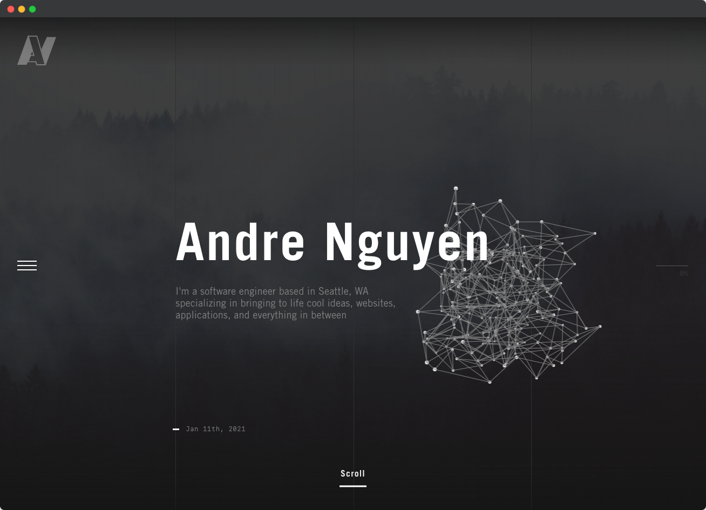

<div align="center">
  
</div>
<h1 align="center">
  andrenguyen.dev
</h1>
<p align="center">
  The third iteration of <a href="https://andrenguyen.dev" target="_blank">andrenguyen.dev</a> built with <a href="https://www.nextjs.org/" target="_blank">Next.js</a> and hosted with <a href="https://www.netlify.com/" target="_blank">Netlify</a>
</p>
<p align="center">
  <a href="https://app.netlify.com/sites/andrenguyen/deploys" target="_blank">
    
  </a>
</p>



## Getting Started

1. Install and use the correct version of Node using [NVM](https://github.com/nvm-sh/nvm)

    ```sh
    nvm install
    ```

2. Install dependencies

    ```sh
    yarn
    ```

3. Start the development server

    ```bash
     yarn dev
    ```

4. Open [http://localhost:3000](http://localhost:3000) with your browser.
